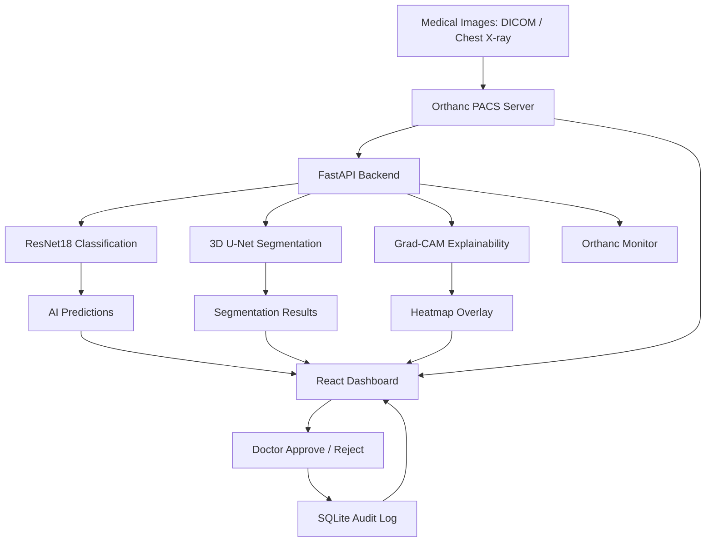

# MedVision System Architecture

```mermaid
flowchart TD
    A[Medical Images: DICOM / Chest X-ray] --> B[Orthanc PACS Server]
    B --> C[FastAPI Backend]

    C --> D[ResNet18 Classification]
    C --> E[3D U-Net Segmentation]
    C --> F[Grad-CAM Explainability]
    C --> G[Orthanc Monitor]

    D --> H[AI Predictions]
    E --> I[Segmentation Results]
    F --> J[Heatmap Overlay]

    H --> K[React Dashboard]
    I --> K
    J --> K
    B --> K

    K --> L[Doctor Approve / Reject]
    L --> M[SQLite Audit Log]
    M --> K
```
